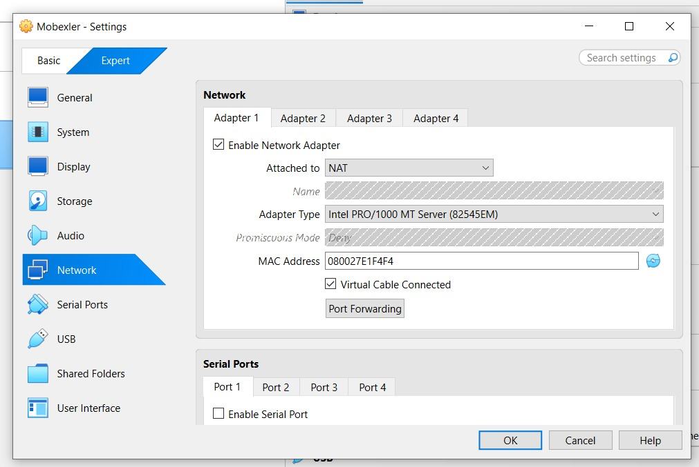
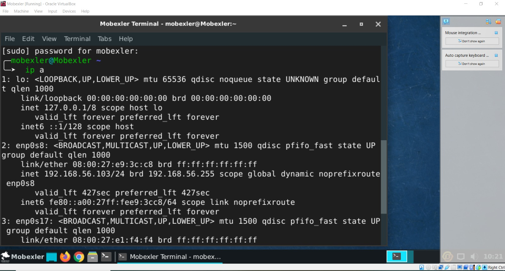
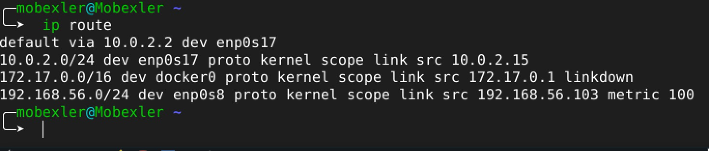
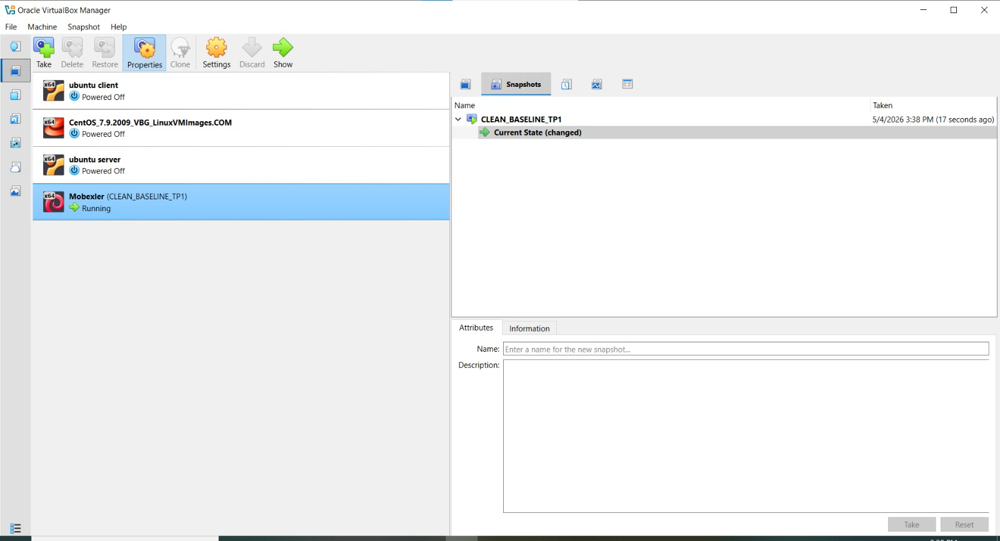
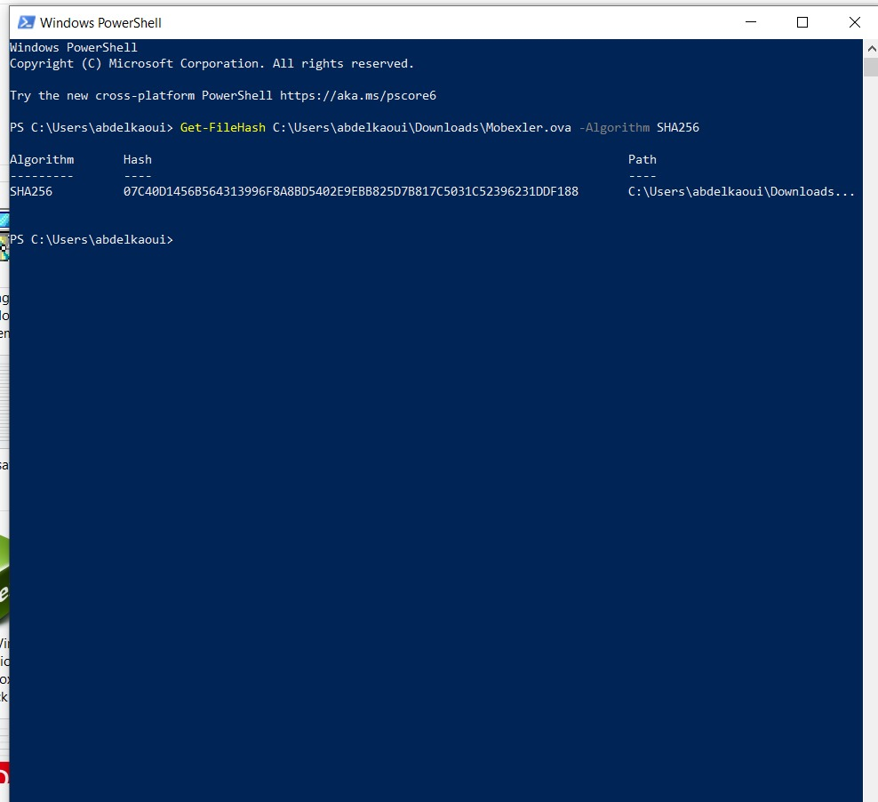

# Mobexler Virtual Machine Network Configuration

## Overview

This section documents the deployment and network configuration of the Mobexler virtual machine using Oracle VirtualBox.  
The objective was to configure Internet connectivity while also enabling communication between the host machine and the guest virtual machine through a Host-Only network.

---

# Step 1 — Launching the Mobexler Virtual Machine

The Mobexler virtual machine was successfully started inside Oracle VirtualBox.

The operating system booted correctly and the desktop environment became accessible.


---

# Step 2 — Configuring Adapter 1 (NAT)

The first network adapter was configured in **NAT mode**.

This adapter allows the virtual machine to access the Internet through the host machine connection.

Configuration details:
- Adapter 1 enabled
- Attached to: NAT
- Adapter type: Intel PRO/1000 MT Server
- Virtual cable connected enabled



---

# Step 3 — Configuring Adapter 2 (Host-Only)

The second adapter was configured as a **Host-Only Adapter**.

This configuration enables direct communication between:
- the host operating system
- the Mobexler virtual machine

Configuration details:
- Adapter 2 enabled
- Attached to: Host-only Adapter
- VirtualBox Host-Only Ethernet Adapter selected


---

# Step 4 — Verifying Network Interfaces Inside Mobexler

The command below was executed:

```bash
ip a
```

The output confirmed the presence of two network interfaces:

- `enp0s8`
  - Host-Only network
  - IP address: `192.168.56.103`

- `enp0s17`
  - NAT network

This verifies that both adapters were detected successfully by the Linux system.



---

# Step 5 — Verifying Routing Configuration

The routing table was checked using:

```bash
ip route
```

The output showed:
- default gateway through the NAT interface
- local Host-Only subnet route

Important routes:
- `default via 10.0.2.2 dev enp0s17`
- `192.168.56.0/24 dev enp0s8`

This confirms that Internet traffic uses the NAT adapter while Host-Only communication remains local.



---

# Step 6 — Testing Network Connectivity

Connectivity tests were performed using the `ping` command.

## Test 1 — External IP Connectivity

```bash
ping -c 2 8.8.8.8
```

Result:
- Successful replies received
- Confirms Internet access

## Test 2 — DNS Resolution

```bash
ping -c 2 google.com
```

Result:
- Successful replies received
- Confirms DNS resolution is working correctly


---

# Step 7 — Virtual Machine Snapshot Verification

A snapshot named:

```text
CLEAN_BASELINE_TP1
```

was created and verified inside VirtualBox.

This snapshot allows restoring the VM to a clean baseline state before future experiments or security testing activities.



---

# Step 8 — SHA256 Integrity Verification

The SHA256 hash of the Mobexler OVA file was calculated using PowerShell:

```powershell
Get-FileHash C:\Users\abdelkaoui\Downloads\Mobexler.ova -Algorithm SHA256
```

Purpose:
- verify file integrity
- ensure the imported virtual appliance was not corrupted or modified

This is an important verification step in security and forensic environments.



---

# Conclusion

The Mobexler virtual machine was successfully configured with:
- Internet access through NAT
- Host-to-guest communication through Host-Only networking
- verified routing and DNS functionality
- validated connectivity tests
- snapshot baseline creation
- SHA256 integrity verification

The environment is now ready for networking, cybersecurity, or forensic laboratory activities.
