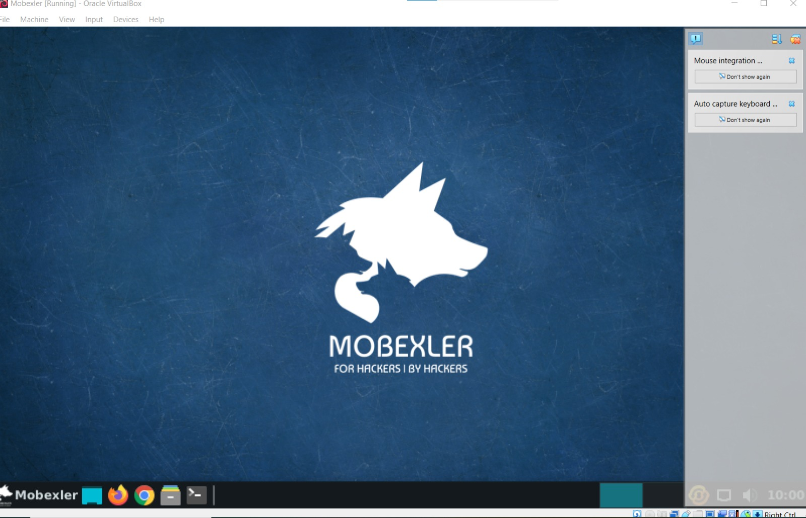
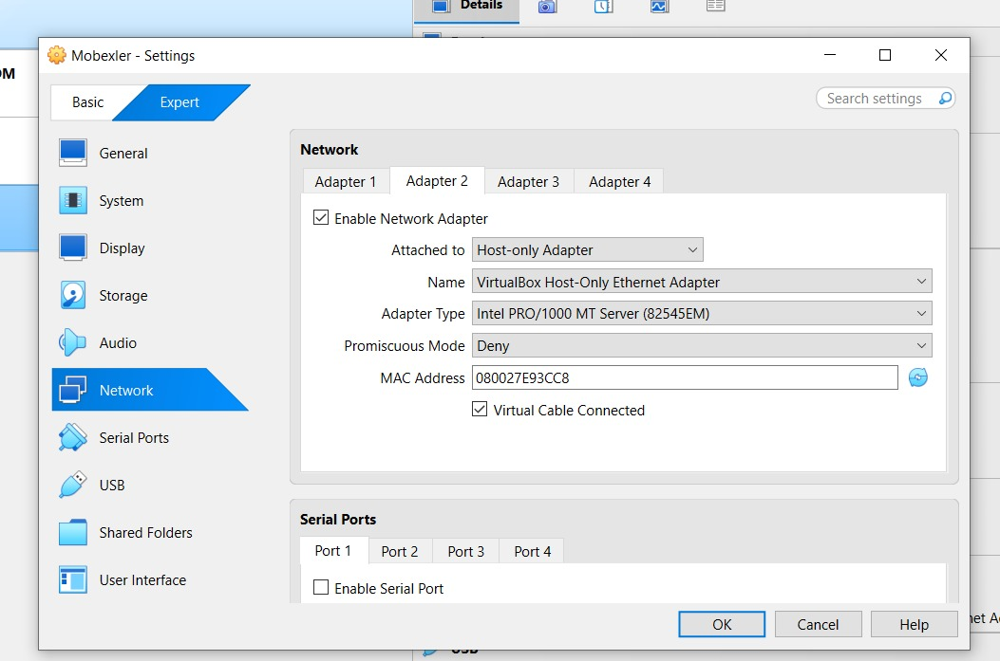
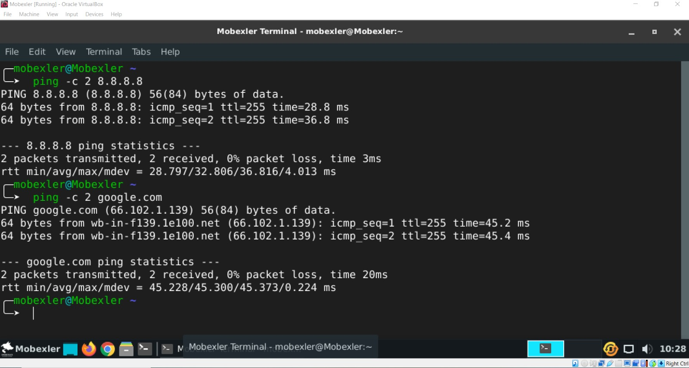

# Mobexler Virtual Machine Network Configuration

## Overview

This section documents the deployment and network configuration of the Mobexler virtual machine using Oracle VirtualBox.

The objective was to:
- configure Internet connectivity using NAT
- enable communication between the host and guest machine using a Host-Only adapter
- verify routing and network access
- create a clean baseline snapshot
- validate the integrity of the imported OVA image

---

# Step 1 — Launching the Mobexler Virtual Machine

The Mobexler virtual machine was successfully launched inside Oracle VirtualBox.

The operating system booted correctly and the desktop environment became accessible.



---

# Step 2 — Configuring Adapter 1 (NAT)

The first network adapter was configured in **NAT mode**.

This adapter allows the virtual machine to access the Internet through the host machine connection.

Configuration details:
- Adapter 1 enabled
- Attached to: NAT
- Adapter type: Intel PRO/1000 MT Server
- Virtual cable connected enabled


---

# Step 3 — Configuring Adapter 2 (Host-Only)

The second adapter was configured as a **Host-Only Adapter**.

This configuration enables direct communication between:
- the host operating system
- the Mobexler virtual machine

Configuration details:
- Adapter 2 enabled
- Attached to: Host-only Adapter
- VirtualBox Host-Only Ethernet Adapter selected



---

# Step 4 — Verifying Network Interfaces

The following command was executed:

```bash
ip a
```

The output confirmed the presence of two network interfaces:

- `enp0s8`
  - Host-Only network
  - IP address: `192.168.56.103`

- `enp0s17`
  - NAT network

This confirms that both adapters were correctly detected by the Linux system.


---

# Step 5 — Verifying Routing Configuration

The routing table was displayed using:

```bash
ip route
```

The result showed:
- a default gateway through the NAT interface
- a local route for the Host-Only network

Important routes:
- `default via 10.0.2.2 dev enp0s17`
- `192.168.56.0/24 dev enp0s8`

This confirms proper routing configuration.


---

# Step 6 — Testing Internet Connectivity

Connectivity tests were performed using the `ping` command.

## Test 1 — External IP Connectivity

```bash
ping -c 2 8.8.8.8
```

Result:
- successful replies received
- confirms Internet connectivity

## Test 2 — DNS Resolution

```bash
ping -c 2 google.com
```

Result:
- successful replies received
- confirms DNS resolution is functioning correctly



---

# Step 7 — Snapshot Verification

A VirtualBox snapshot named:

```text
CLEAN_BASELINE_TP1
```

was successfully created.

This snapshot allows restoring the environment to a clean baseline state before future testing or experimentation.


---

# Step 8 — SHA256 Integrity Verification

The SHA256 hash of the Mobexler OVA file was calculated using PowerShell:

```powershell
Get-FileHash C:\Users\abdelkaoui\Downloads\Mobexler.ova -Algorithm SHA256
```

Purpose:
- verify file integrity
- ensure the appliance was not corrupted or modified before use

This is an important verification step in forensic and cybersecurity environments.


---

# Conclusion

The Mobexler virtual machine was successfully configured with:
- Internet access through NAT
- Host-to-guest communication through Host-Only networking
- verified routing configuration
- successful connectivity tests
- snapshot baseline creation
- SHA256 integrity verification

The environment is now ready for networking, cybersecurity, and forensic laboratory activities.
